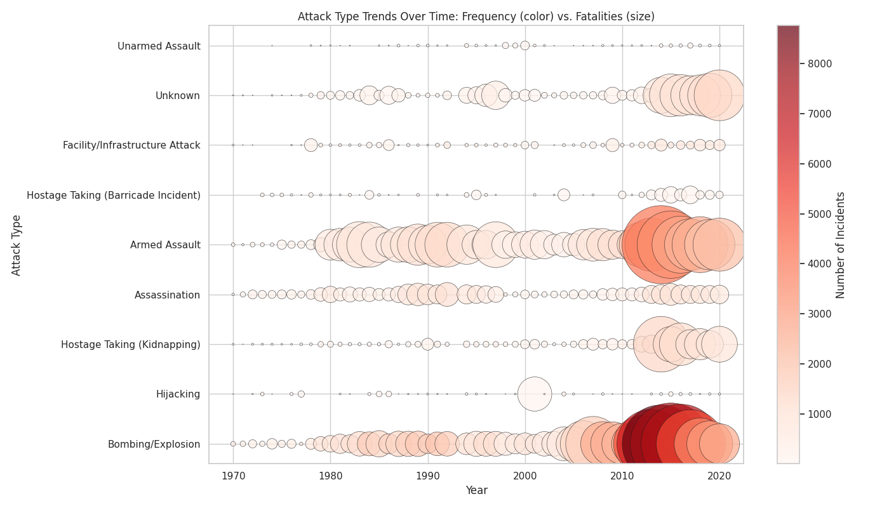

# Global Terrorism: How Has it Changed and How is it Reported?

### Authors: Teagan Britten and Vinith Jayamani 

## Data Source
Our data has been collected from two separate locations to facilitate our analysis. One of these sources is the Global Terrorism Database, or GTD, that contains information on over two hundred thousand terrorist attacks dating back to 1970. Entries include the type of attack, the location, and the suspected motive or affiliation of the attacker/s.
The other source used is the News API, which draws news articles from over one hundred and fifty thousand sources worldwide. We were able to filter the news api in order to look for specific keywords such that articles that pertained to our topic would be collected over the course of a few days. 

## Our Challenges
The News API served as fantastic access to news articles from a wide variety of news and media sources, but that impact was limited due to the restrictions on API calls. We were able to access just 100 articles at a time and, with the intent to access the most recent articles, were not able to collect nearly as many as we had intended to. Working with the Global Terrorism Database produced its own challenges, with it being such a large collection of data to manage. DuckDB acted as a very useful tool for processing and holding this data. 

## Analysis

Upon observing the data, it appears clear that instances and fatalities have increased reasonably consistently since 1970. This cumulated in a peak in terrorist activity in the 2010s, with over 40,000 fatalities connected to terrorism in the middle of the decade. This increase was largely fueled by a much greater number of bombings between 2010 and 2020. Armed assaults, often using firearms, also saw a significant increase during this time that further explains the numbers of fatalities seen. 

News data collected from 11/28-11/30/2025 helps us to look at how terrorism occurs in the modern day and how that is communicated to the public. Looking at the headlines of terror-related articles from this period reflect the occurrence of 

